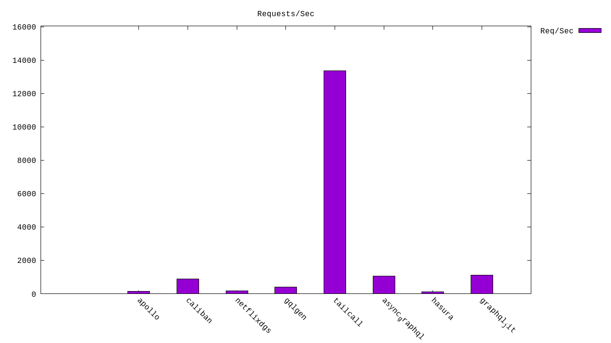
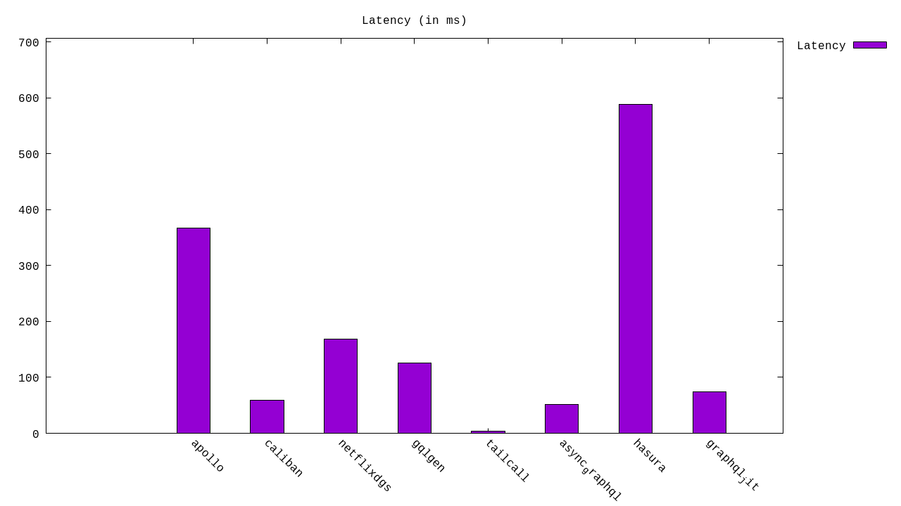
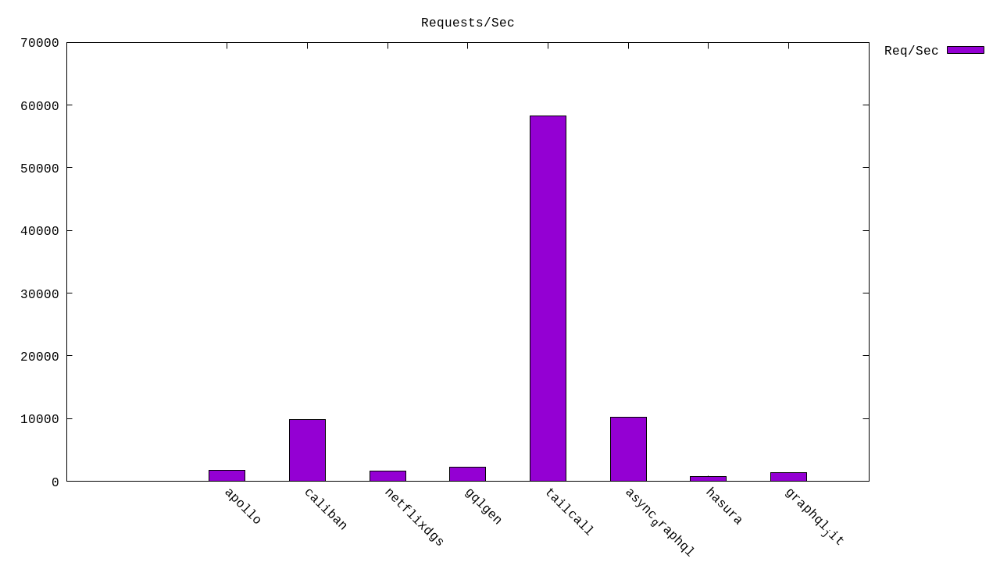
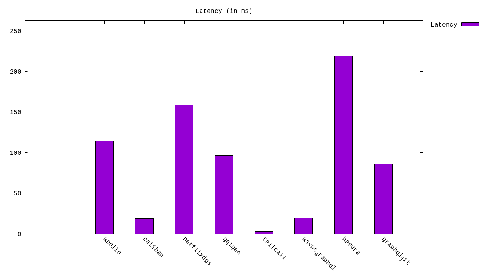
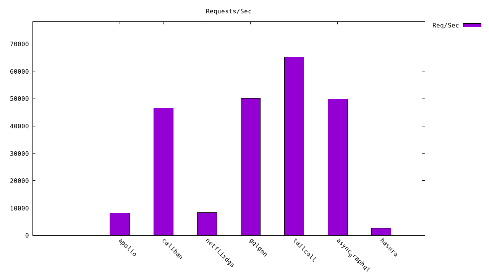
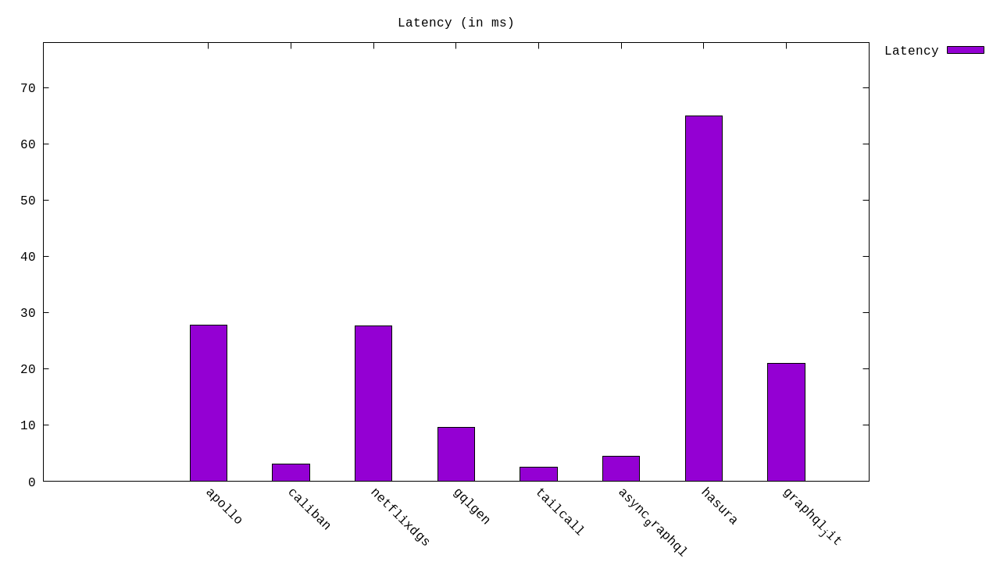
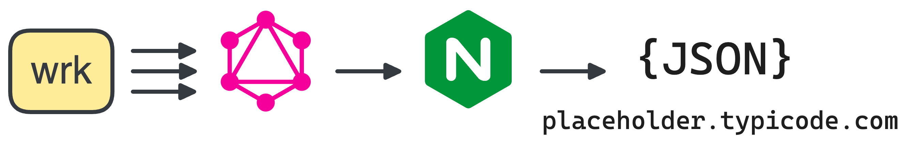

<!-- ⚠️⚠️⚠️ THIS FILE IS AUTO GENERATED DO NOT EDIT DIRECTLY ⚠️⚠️⚠️ -->

# GraphQL Benchmarks <!-- omit from toc -->

[](https://codespaces.new/tailcallhq/graphql-benchmarks)

Explore and compare the performance of the fastest GraphQL frameworks through our comprehensive benchmarks.

- [Introduction](#introduction)
- [Quick Start](#quick-start)
- [Benchmark Results](#benchmark-results)
  - [Throughput (Higher is better)](#throughput-higher-is-better)
  - [Latency (Lower is better)](#latency-lower-is-better)
- [Architecture](#architecture)
  - [WRK](#wrk)
  - [GraphQL](#graphql)
  - [Nginx](#nginx)
  - [Jsonplaceholder](#jsonplaceholder)
- [GraphQL Schema](#graphql-schema)
- [Contribute](#contribute)

[Tailcall]: https://github.com/tailcallhq/tailcall
[Gqlgen]: https://github.com/99designs/gqlgen
[Apollo GraphQL]: https://github.com/apollographql/apollo-server
[Netflix DGS]: https://github.com/netflix/dgs-framework
[Caliban]: https://github.com/ghostdogpr/caliban
[async-graphql]: https://github.com/async-graphql/async-graphql
[Hasura]: https://github.com/hasura/graphql-engine

## Introduction

This document presents a comparative analysis of several renowned GraphQL frameworks. Dive deep into the performance metrics, and get insights into their throughput and latency.

> **NOTE:** This is a work in progress suite of benchmarks, and we would appreciate help from the community to add more frameworks or tune the existing ones for better performance.

## Quick Start

Get started with the benchmarks:

1. Click on this [link](https://codespaces.new/tailcallhq/graphql-benchmarks) to set up on GitHub Codespaces.
2. Once set up in Codespaces, initiate the benchmark tests:

```bash
./setup.sh
./run_benchmarks.sh
```

## Benchmark Results

<!-- PERFORMANCE_RESULTS_START -->


Query: `
    {
      "operationName": null,
      "variables": {},
      "query": "{posts{id,userId,title,user{id,name,email}}}"
    }
    `

| Server         | Requests/sec | Latency (ms) | Relative |
| -------------- | ------------ | ------------ | -------- |
| Tailcall       | `89,291.15`  | `1.13`       | `41.99x` |
| Netflix DGS    | `56,825.47`  | `0.00`       | `26.73x` |
| Apollo GraphQL | `56,134.52`  | `0.00`       | `26.40x` |
| async-graphql  | `37,721.58`  | `2.65`       | `17.74x` |
| Gqlgen         | `35,032.42`  | `2.85`       | `16.48x` |
| Caliban        | `29,028.39`  | `5.59`       | `13.65x` |
| GraphQL JIT    | `4,325.73`   | `23.14`      | `2.03x`  |
| Hasura         | `2,126.24`   | `47.24`      | `1.00x`  |

Query: `
    {
      "operationName": null,
      "variables": {},
      "query": "{posts{title}}"
    }
    `

| Server         | Requests/sec | Latency (ms) | Relative |
| -------------- | ------------ | ------------ | -------- |
| Tailcall       | `95,058.09`  | `1.05`       | `31.29x` |
| Apollo GraphQL | `57,698.88`  | `0.00`       | `18.99x` |
| Netflix DGS    | `57,434.55`  | `0.00`       | `18.91x` |
| async-graphql  | `38,962.58`  | `2.56`       | `12.83x` |
| Gqlgen         | `34,854.01`  | `2.87`       | `11.47x` |
| Caliban        | `31,380.15`  | `3.19`       | `10.33x` |
| GraphQL JIT    | `4,416.48`   | `22.65`      | `1.45x`  |
| Hasura         | `3,037.81`   | `32.93`      | `1.00x`  |

Query: `
    {
      "operationName": null,
      "variables": {},
      "query": "{greet}"
    }
    `

| Server         | Requests/sec | Latency (ms) | Relative |
| -------------- | ------------ | ------------ | -------- |
| async-graphql  | `109,626.13` | `0.91`       | `25.15x` |
| Tailcall       | `102,125.18` | `0.98`       | `23.43x` |
| Caliban        | `101,194.55` | `0.98`       | `23.22x` |
| Gqlgen         | `78,166.85`  | `1.28`       | `17.94x` |
| Netflix DGS    | `56,970.59`  | `0.00`       | `13.07x` |
| Apollo GraphQL | `54,844.17`  | `0.00`       | `12.58x` |
| GraphQL JIT    | `14,623.61`  | `6.84`       | `3.36x`  |
| Hasura         | `4,358.08`   | `23.00`      | `1.00x`  |

<!-- PERFORMANCE_RESULTS_END -->


### 1. `{posts {title body user {name}}}`
#### Throughput (Higher is better)



#### Latency (Lower is better)



### 2. `{posts {title body}}`
#### Throughput (Higher is better)



#### Latency (Lower is better)



### 3. `{greet}`
#### Throughput (Higher is better)



#### Latency (Lower is better)



## Architecture



A client (`wrk`) sends requests to a GraphQL server to fetch post titles. The GraphQL server, in turn, retrieves data from an external source, `jsonplaceholder.typicode.com`, routed through the `nginx` reverse proxy.

### WRK

`wrk` serves as our test client, sending GraphQL requests at a high rate.

### GraphQL

Our tested GraphQL server. We evaluated various implementations, ensuring no caching on the GraphQL server side.

### Nginx

A reverse-proxy that caches every response, mitigating rate-limiting and reducing network uncertainties.

### Jsonplaceholder

The primary upstream service forming the base for our GraphQL API. We query its `/posts` API via the GraphQL server.

## GraphQL Schema

Inspect the generated GraphQL schema employed for the benchmarks:

```graphql
schema {
  query: Query
}

type Query {
  posts: [Post]
}

type Post {
  id: Int!
  userId: Int!
  title: String!
  body: String!
  user: User
}

type User {
  id: Int!
  name: String!
  username: String!
  email: String!
  phone: String
  website: String
}
```

## Contribute

Your insights are invaluable! Test these benchmarks, share feedback, or contribute by adding more GraphQL frameworks or refining existing ones. Open an issue or a pull request, and let's build a robust benchmarking resource together!
