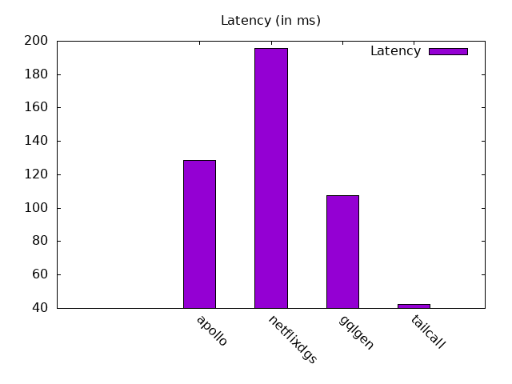
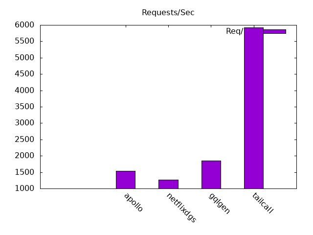

---

# GraphQL Frameworks Benchmark

A comparative analysis of several popular GraphQL frameworks:

- **Tailcall** - [GitHub](https://github.com/tailcallhq/tailcall) (Rust)
- **gqlgen** - [GitHub](https://github.com/99designs/gqlgen) (Go)
- **Apollo Server** - [Official Docs](https://www.apollographql.com/docs/apollo-server/) (NodeJS)
- **Netflix DGS** - [Official Docs](https://netflix.github.io/dgs/) (Java)

## Prerequisites

Before you start with the benchmarks, ensure you have the following tools and languages installed:

- Rust
- GoLang
- NodeJs
- Java 17
- `wrk` (Benchmarking tool)

## Setting up the Benchmark

Kickstart your benchmarking environment with just one click:

[](https://codespaces.new/tailcallhq/benchmarks)

## Execution

Once the post-creation setup in Codespaces is complete, initiate the benchmark tests using:

```bash
./run_benchmarks.sh
```

## Benchmark Results

Below are the visualizations for latency and throughput comparisons across the frameworks:

|  |  |
|:--------------------------------------------:|:------------------------------------------------:|
|                 Latency Histogram             |              Requests/sec Histogram              |
