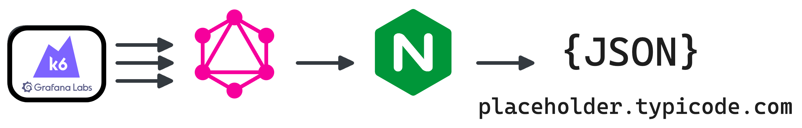

# GraphQL Benchmarks <!-- omit from toc -->

[](https://codespaces.new/tailcallhq/graphql-benchmarks)

Explore and compare the performance of the fastest GraphQL frameworks through our comprehensive benchmarks.

- [Introduction](#introduction)
- [Quick Start](#quick-start)
- [Benchmark Results](#benchmark-results)
  - [Throughput (Higher is better)](#throughput-higher-is-better)
  - [Latency (Lower is better)](#latency-lower-is-better)
- [Architecture](#architecture)
  - [WRK](#wrk)
  - [GraphQL](#graphql)
  - [Nginx](#nginx)
  - [Jsonplaceholder](#jsonplaceholder)
- [GraphQL Schema](#graphql-schema)
- [Contribute](#contribute)

[Tailcall]: https://tailcall.run/
[Gqlgen]: https://gqlgen.com/
[Apollo GraphQL]: https://new.apollographql.com/
[Netflix DGS]: https://netflix.github.io/dgs/
[Caliban]: https://ghostdogpr.github.io/caliban/
[async-graphql]: https://github.com/async-graphql/async-graphql

## Introduction

This document presents a comparative analysis of several renowned GraphQL frameworks. Dive deep into the performance metrics, and get insights into their throughput and latency.

> **NOTE:** This is a work in progress suite of benchmarks, and we would appreciate help from the community to add more frameworks or tune the existing ones for better performance.

## Quick Start

Get started with the benchmarks:

1. Click on this [link](https://codespaces.new/tailcallhq/graphql-benchmarks) to set up on GitHub Codespaces.
2. Once set up in Codespaces, initiate the benchmark tests:

```bash
./setup.sh
./run_benchmarks.sh
```

## Benchmark Results

### Test Query
```graphql
{
  posts {
    title
  }
}
```

<!-- PERFORMANCE_RESULTS_START_1 -->

| Server | Requests/sec | Latency (ms) |
|--------:|--------------:|--------------:|
| [Tailcall] | `101,998.18` | `0.98` |
| [async-graphql] | `40,900.27` | `2.44` |
| [Caliban] | `33,802.21` | `2.95` |
| [Gqlgen] | `31,334.28` | `3.19` |
| [Apollo GraphQL] | `13,675.53` | `7.32` |
| [Netflix DGS] | `221.68` | `461.36` |

<!-- PERFORMANCE_RESULTS_END_1 -->

### Throughput (Higher is better)


### Latency (Lower is better)


---

### Test Query
```graphql
{
  posts {
    id
    userId
    title
    user {
      id
      name
      email
    }
  }
}
```

<!-- PERFORMANCE_RESULTS_START_2 -->

| Server | Requests/sec | Latency (ms) |
|--------:|--------------:|--------------:|
| [Tailcall] | `104,244.97` | `0.95` |
| [async-graphql] | `41,352.03` | `2.42` |
| [Caliban] | `32,482.42` | `3.08` |
| [Gqlgen] | `27,677.71` | `3.62` |
| [Apollo GraphQL] | `13,540.54` | `7.39` |
| [Netflix DGS] | `3.33` | `0.00` |

<!-- PERFORMANCE_RESULTS_END_2 -->

### Throughput (Higher is better)


### Latency (Lower is better)


## Architecture



A client (`wrk`) sends requests to a GraphQL server to fetch post titles. The GraphQL server, in turn, retrieves data from an external source, `jsonplaceholder.typicode.com`, routed through the `nginx` reverse proxy.

### WRK

`wrk` serves as our test client, sending GraphQL requests at a high rate.

### GraphQL

Our tested GraphQL server. We evaluated various implementations, ensuring no caching on the GraphQL server side.

### Nginx

A reverse-proxy that caches every response, mitigating rate-limiting and reducing network uncertainties.

### Jsonplaceholder

The primary upstream service forming the base for our GraphQL API. We query its `/posts` API via the GraphQL server.

## GraphQL Schema

Inspect the generated GraphQL schema employed for the benchmarks:

```graphql
schema {
  query: Query
}

type Query {
  posts: [Post]
}

type Post {
  id: Int!
  userId: Int!
  title: String!
  body: String!
  user: User
}

type User {
  id: Int!
  name: String!
  username: String!
  email: String!
  phone: String
  website: String
}
```

## Contribute

Your insights are invaluable! Test these benchmarks, share feedback, or contribute by adding more GraphQL frameworks or refining existing ones. Open an issue or a pull request, and let's build a robust benchmarking resource together!
