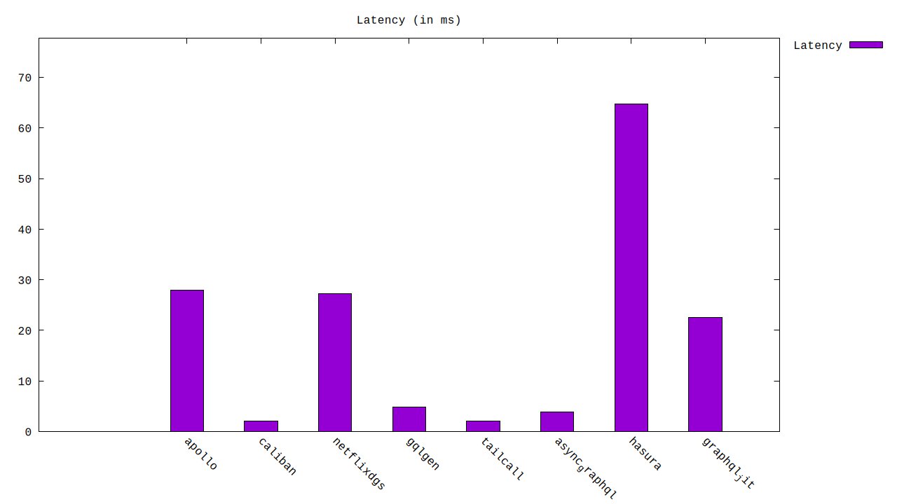

# GraphQL Benchmarks <!-- omit from toc -->

[](https://codespaces.new/tailcallhq/graphql-benchmarks)

Explore and compare the performance of the fastest GraphQL frameworks through our comprehensive benchmarks.

- [Introduction](#introduction)
- [Quick Start](#quick-start)
- [Benchmark Results](#benchmark-results)
  - [Throughput (Higher is better)](#throughput-higher-is-better)
  - [Latency (Lower is better)](#latency-lower-is-better)
- [Architecture](#architecture)
  - [WRK](#wrk)
  - [GraphQL](#graphql)
  - [Nginx](#nginx)
  - [Jsonplaceholder](#jsonplaceholder)
- [GraphQL Schema](#graphql-schema)
- [Contribute](#contribute)

[Tailcall]: https://github.com/tailcallhq/tailcall
[Gqlgen]: https://github.com/99designs/gqlgen
[Apollo GraphQL]: https://github.com/apollographql/apollo-server
[Netflix DGS]: https://github.com/netflix/dgs-framework
[Caliban]: https://github.com/ghostdogpr/caliban
[async-graphql]: https://github.com/async-graphql/async-graphql
[Hasura]: https://github.com/hasura/graphql-engine
[GraphQL JIT]: https://github.com/zalando-incubator/graphql-jit

## Introduction

This document presents a comparative analysis of several renowned GraphQL frameworks. Dive deep into the performance metrics, and get insights into their throughput and latency.

> **NOTE:** This is a work in progress suite of benchmarks, and we would appreciate help from the community to add more frameworks or tune the existing ones for better performance.

## Quick Start

Get started with the benchmarks:

1. Click on this [link](https://codespaces.new/tailcallhq/graphql-benchmarks) to set up on GitHub Codespaces.
2. Once set up in Codespaces, initiate the benchmark tests:

```bash
./setup.sh
./run_benchmarks.sh
```

## Benchmark Results

<!-- PERFORMANCE_RESULTS_START -->

| Query | Server | Requests/sec | Latency (ms) | Relative |
|-------:|--------:|--------------:|--------------:|---------:|
| 1 | `{ posts { id userId title user { id name email }}}` |
|| [Tailcall] | `30,463.00` | `3.27` | `110.19x` |
|| [async-graphql] | `1,898.15` | `52.93` | `6.87x` |
|| [Caliban] | `1,613.68` | `61.68` | `5.84x` |
|| [Hasura] | `1,511.23` | `66.00` | `5.47x` |
|| [GraphQL JIT] | `1,370.31` | `72.66` | `4.96x` |
|| [Gqlgen] | `770.77` | `128.70` | `2.79x` |
|| [Netflix DGS] | `365.39` | `171.86` | `1.32x` |
|| [Apollo GraphQL] | `276.45` | `355.52` | `1.00x` |
| 2 | `{ posts { title }}` |
|| [Tailcall] | `62,903.50` | `1.58` | `44.81x` |
|| [async-graphql] | `9,588.48` | `10.51` | `6.83x` |
|| [Caliban] | `9,386.69` | `11.03` | `6.69x` |
|| [Hasura] | `2,492.70` | `40.09` | `1.78x` |
|| [Gqlgen] | `2,183.56` | `47.53` | `1.56x` |
|| [Apollo GraphQL] | `1,782.59` | `56.05` | `1.27x` |
|| [Netflix DGS] | `1,605.40` | `70.00` | `1.14x` |
|| [GraphQL JIT] | `1,403.93` | `71.12` | `1.00x` |
| 3 | `{ greet }` |
|| [Caliban] | `69,457.20` | `1.03` | `27.34x` |
|| [Tailcall] | `64,753.90` | `1.55` | `25.49x` |
|| [async-graphql] | `51,173.90` | `2.06` | `20.14x` |
|| [Gqlgen] | `48,313.00` | `5.00` | `19.02x` |
|| [Netflix DGS] | `8,279.33` | `14.54` | `3.26x` |
|| [Apollo GraphQL] | `8,151.91` | `12.45` | `3.21x` |
|| [GraphQL JIT] | `5,205.96` | `19.18` | `2.05x` |
|| [Hasura] | `2,540.38` | `39.31` | `1.00x` |

<!-- PERFORMANCE_RESULTS_END -->


### 1. `{posts {title body user {name}}}`
#### Throughput (Higher is better)


#### Latency (Lower is better)


### 2. `{posts {title body}}`
#### Throughput (Higher is better)


#### Latency (Lower is better)


### 3. `{greet}`
#### Throughput (Higher is better)


#### Latency (Lower is better)



## Architecture


A client (`wrk`) sends requests to a GraphQL server to fetch post titles. The GraphQL server, in turn, retrieves data from an external source, `jsonplaceholder.typicode.com`, routed through the `nginx` reverse proxy.

### WRK

`wrk` serves as our test client, sending GraphQL requests at a high rate.

### GraphQL

Our tested GraphQL server. We evaluated various implementations, ensuring no caching on the GraphQL server side.

### Nginx

A reverse-proxy that caches every response, mitigating rate-limiting and reducing network uncertainties.

### Jsonplaceholder

The primary upstream service forming the base for our GraphQL API. We query its `/posts` API via the GraphQL server.

## GraphQL Schema

Inspect the generated GraphQL schema employed for the benchmarks:

```graphql
schema {
  query: Query
}

type Query {
  posts: [Post]
}

type Post {
  id: Int!
  userId: Int!
  title: String!
  body: String!
  user: User
}

type User {
  id: Int!
  name: String!
  username: String!
  email: String!
  phone: String
  website: String
}
```

## Contribute

Your insights are invaluable! Test these benchmarks, share feedback, or contribute by adding more GraphQL frameworks or refining existing ones. Open an issue or a pull request, and let's build a robust benchmarking resource together!
